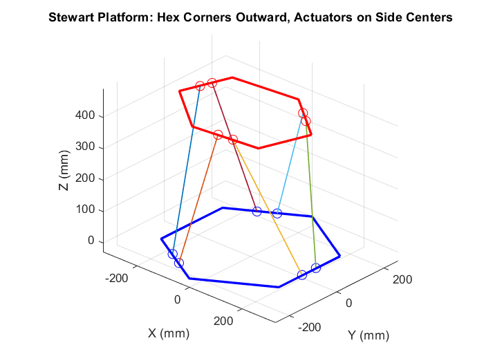
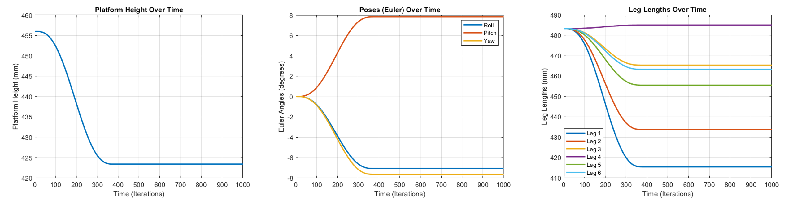

# pinn_pmp
Passive motion paradigm for parallel robots using self-supervised physics-informed neural networks

# PINN training
To implement the paradigm, the first step is to train the PINN model. 

We provided some MATLAB code in the visualization folder, where user can reuse and define their platform and visualize it.  

    visualization.m

    
Inverse kinematics is well-defined in the data file (it can generate data for ANN and PINN training):

    data.m
  
Once data is generated, you can train a PINN model:

    python3 pinntrain.py

# PMP implementation

After the training, a model(.pth) will be obtained, then please set your target length (.txt) and run the following example to execute PM,P which will print and record the result (.txt)

    python3 pmp_parallel.py

Back in the visualization folder, the results can be plotted:

    plot_result.m

